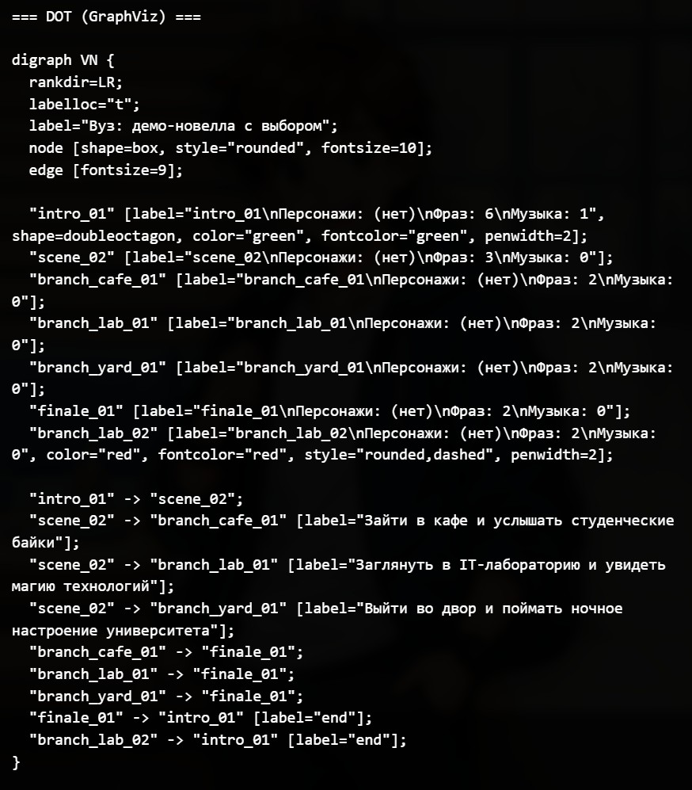
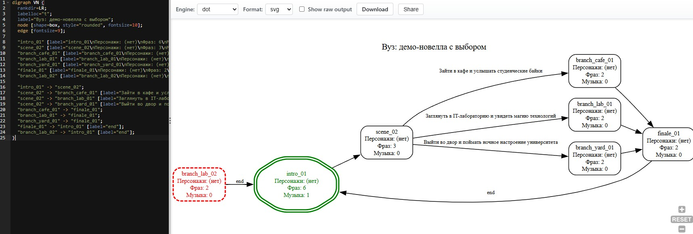

# 🎮 Visual Novel Vertical Engine (HTML/CSS/JS)

Лёгкий движок визуальных новелл на **HTML, CSS и JavaScript**, разработанный специально для **вертикальных экранов** и **портретных дисплеев**, включая **4K телевизоры, установленные вертикально**.

Движок работает **полностью офлайн**, не требует сборки, серверной части или сторонних библиотек. Достаточно открыть `index.html` в браузере.

Проект вдохновлён принципами сценариев визуальных новелл (например, Ren'Py), но реализован как **минималистичная браузерная система**, удобная для демонстрационных и образовательных проектов.

---

## ✨ Особенности

- 📱 интерфейс для **вертикальных экранов**
- 🖥 оптимизация под **4K телевизоры**
- 📐 пропорция интерфейса **7:16**, а также адаптация под другое соотношение сторон
- 🌐 **полностью офлайн**
- ⚡ не требует сборки или фреймворков
- 🧾 простой **текстовый формат сценария**
- 🖼 поддержка **фонов**
- 🎭 **персонажи и эмоции**
- 💬 диалоги
- 🔀 **ветвления сюжета**
- 🎵 фоновая музыка
- 🎮 возможность подключения **мини-игр через iframe** _(в разработке)_
- 📊 встроенная **статистика загрузки ресурсов**

---

## 📷 Демонстрация

### Демонстрационная версия новеллы

<p align="center">
 
 

</p>

### Возможности для анализа разработаываемой новеллы

Проверка на ошибки и построение текста графа в формате dot.

<p align="center">
 
</p>

Построение графа в онлайн-сервисе graphviz-online и контроль сценария и возможных ошибок (отмечены красным)

<p align="center">

</p>

#### Проверка на ошибки


---

## 🧩 Где можно использовать

Движок подходит для:
- интерактивных историй
- музейных инсталляций
- выставочных стендов
- образовательных проектов
- интерактивных экранов в университетах
- сюжетных браузерных игр
- вертикальных информационных киосков

---

## 📁 Структура проекта

```
project/
│
├── README.md
├── LICENSE
│
├── index.html
├── engine.css
├── engine.js
│
├── story-loader.js
├── story.js
│
└── assets/
         ├── backgrounds/
         ├── characters/
         ├── audio/
         └── minigames/
```

---
## 🚀 Быстрый запуск

1. Скачать последнюю версию движка:

👉 **[Скачать Latest Release](https://github.com/IlyaBarilo/vn-vertical-engine/releases/latest)**

2. Распаковать архив.

3. Открыть файл **index.html** в браузере.

Движок работает полностью **офлайн**.

---

## 📝 Формат сценария

Сценарий хранится в `story.js` в виде текстового блока.

Пример:

```javascript
window.STORY_TEXT = `

# МЕТАДАННЫЕ
title: Demo Story
startScene: intro

[bg]
hall = assets/bg\_hall.jpg

[char]
anna image neutral = assets/ch_anna_neutral.png
anna name = "Anna"
anna color = #0F0

[audio]
bgmDay = assets/bgm_day.mp3

scene intro

bg hall

show anna neutral

anna: "Добро пожаловать в демонстрацию."

menu
"Пойти в лабораторию" -> lab_scene
"Пойти в кафе" -> cafe_scene
`;
```

---
## 🎬 Основные команды

### Сцена

```
scene scene_id
```
---

### Фон

```
bg backgroundId
```

---

### Персонажи

```
show character emotion
hide all
```

---

### Диалоги

Персонаж:
```
anna: "Текст персонажа"
```

Рассказчик:
```
"Текст рассказчика"
```
---

### Выбор

```
menu
"Вариант 1" -> scene_a
"Вариант 2" -> scene_b
```

---

### Переход

```
goto scene_id
```

---

### Музыка

```
bgm musicId
bgm musicId loop
bgm stop
```

---

## 🎮 Мини-игры (в разработке)

Движок поддерживает подключение мини-игр через **iframe**.

Это позволяет встроить любую HTML-игру прямо в сюжет.

---

## ⚙ Настройка интерфейса

Интерфейс рассчитан на **высокие вертикальные экраны**.

Поддерживаются настройки:
- верхний отступ интерфейса
- нижний отступ

Это позволяет адаптировать игру под **очень высокие дисплеи и вертикальные телевизоры**.

---

## ⚠ Ограничения текущей версии

- отсутствует система сохранений
- формат сценария минималистичный

Движок ориентирован на **простые интерактивные проекты и инсталляции**.

---

## 🔮 Возможные улучшения

Возможные направления развития:
- система сохранений
- анимации
- дополнительные команды сценария


