# 🎮 Visual Novel Vertical Engine

<p align="center">
  <strong>Lightweight HTML/CSS/JS visual novel engine built for vertical screens.</strong>
</p>

<p align="center">
  Offline • No build tools • Portrait-first • 4K vertical display ready
</p>

<p align="center">
  <a href="https://ilyabarilo.github.io/vn-vertical-engine/">
    
  </a>
</p>

<p align="center">
  <a href="https://github.com/IlyaBarilo/vn-vertical-engine/stargazers">
    
  </a>
  <a href="https://github.com/IlyaBarilo/vn-vertical-engine/blob/main/LICENSE">
    
  </a>
  <a href="https://github.com/IlyaBarilo/vn-vertical-engine/releases/latest">
    
  </a>
  <a href="https://github.com/IlyaBarilo/vn-vertical-engine/commits/main">
    
  </a>
  <a href="https://github.com/IlyaBarilo/vn-vertical-engine/releases/latest">
    
  </a>
  <a href="https://ilyabarilo.github.io/vn-vertical-engine/">
  
</a>
</p>


A lightweight **offline visual novel engine** built with HTML, CSS, and JavaScript.

Designed for **vertical screens**, **portrait displays**, and **real-world installations** — from kiosks to 4K TVs.

It now also includes **360 scene navigation**, embeddable **HTML mini-games**,
story video support, and local authoring tools for building interactive
installations without a build step.

No setup. No dependencies. Just open `index.html` and start.

> Free for noncommercial use.
> Educational institutions may also use this software under the default public license.
> See [LICENSE](LICENSE) for other permitted cases under PolyForm Noncommercial 1.0.0.
> Commercial use outside those cases requires separate written permission from the author.

---

## ✨ Features

-   📱 UI optimized for **vertical screens**
-   🖥 optimized for **4K displays**
-   📐 interface ratio **7:16**, with support for other aspect ratios
-   🌐 **fully offline**
-   ⚡ no build tools or frameworks required
-   🧾 simple **text-based scripting format**
-   🖼 support for **backgrounds**
-   🎭 **characters and emotions**
-   💬 dialogue system
-   🔀 **branching storylines**
-   🎵 background music support
-   🎬 story videos and video backgrounds
-   🌐 **360 backgrounds** with markers, compass labels, and multi-panorama spaces
-   🎮 embeddable **HTML mini-games** via a strict iframe protocol
-   🛠 local tools for 360 editing, media focus tuning, conversion, and game testing
-   💾 automatic local autosave and restore of story progress
-   📊 built-in **resource loading statistics**
-   📘 **Specifications:** [Story scripting](docs/specs/SPEC-STORY.md), [Mini-games](docs/specs/SPEC-GAME.md)

---

## 📷 Demo

### 🖼️ Visual Novel Demo

<p align="center">


</p>

Also supports horizontal mode:

<p align="center">

</p>

---

### 🖥 Interactive Display

The same project runs on a vertical touch display. These real installation
photos show the visual novel interface, built-in mini-game launcher, and story
graph view on an interactive TV.

<p align="center">
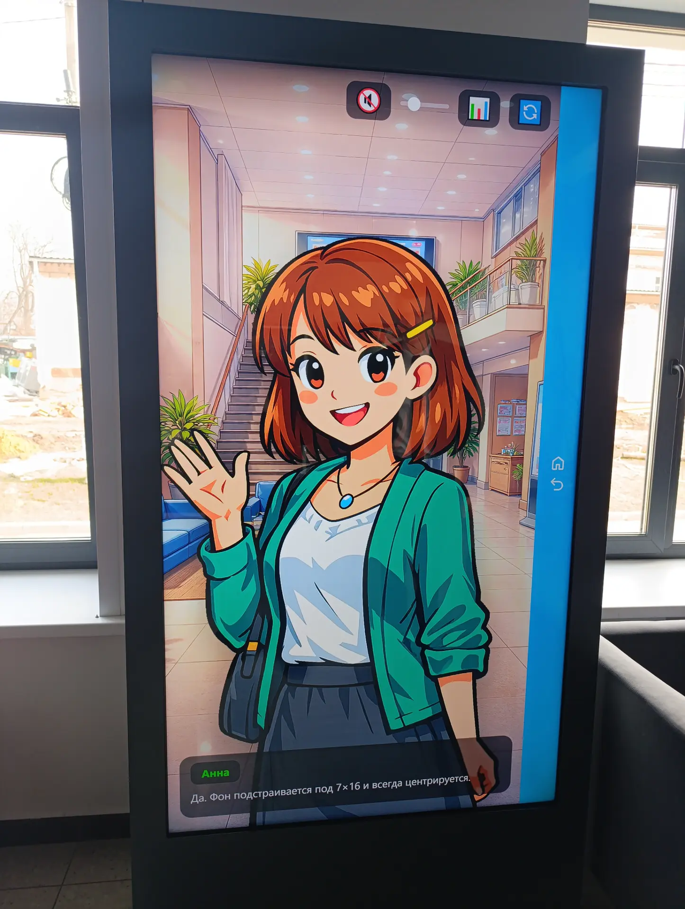

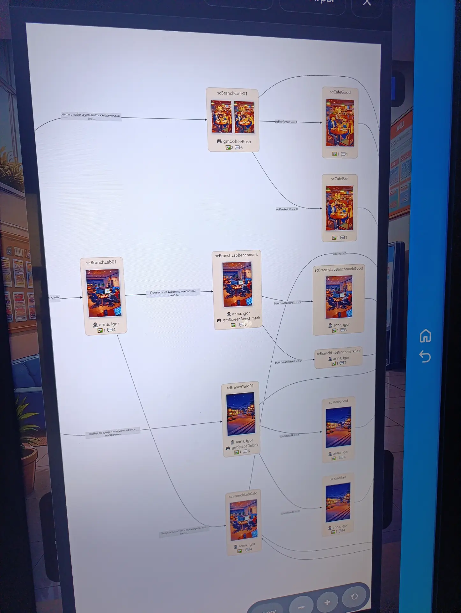
</p>

---

### 🌐 360 Spaces

The engine can render 360 backgrounds, place interactive markers inside the
panorama, and connect multiple panoramas into a navigable `story360.js` space.
The bundled demo shows single 360 scenes with `bg360marks` and `walk360`;
larger connected routes are authored as `story360.js` maps and entered with
`goto360`.

<p align="center">

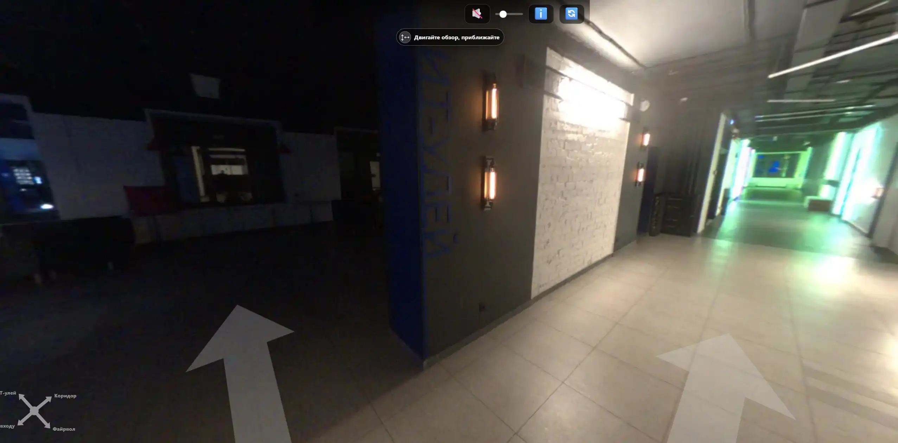
</p>

Panoramas can also be used as stylized story locations, from realistic spaces
to generated fantasy or sci-fi rooms.

<p align="center">
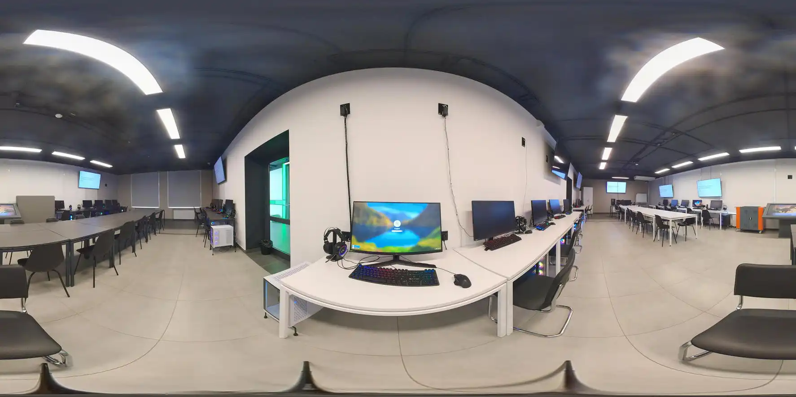


</p>

---

### 🎮 Mini-games

Stories can embed standalone HTML mini-games through an iframe protocol. The
engine sends `gameInit` parameters such as difficulty, waits for one final
`gameResult`, and can use the returned value for branching.

The [mini-game specification](docs/specs/SPEC-GAME.md) is written for both
humans and AI assistants. It can be used as a prompt-ready contract for creating
AI-generated mini-games that integrate back into the novel and exchange
parameters with the story through `gameInit` and `gameResult`.

Mini-game AI prompt template:

```text
Create a mini-game about <TOPIC> in the style of <STYLE>, where the player must <WHAT THE PLAYER DOES>.

When developing the game, you must use the attached SPEC-GAME.md specification file.
```

<p align="center">

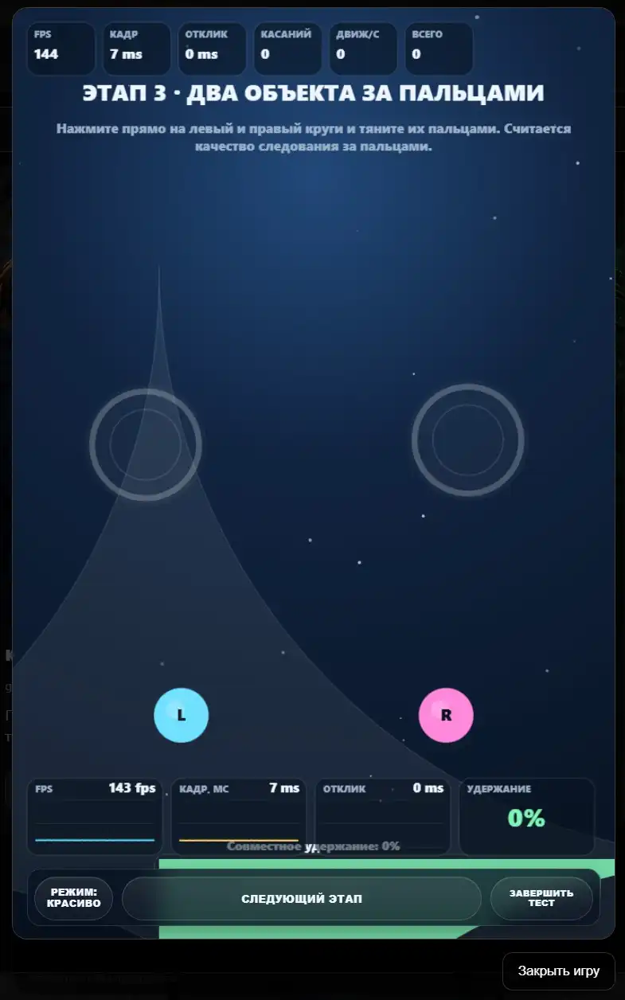
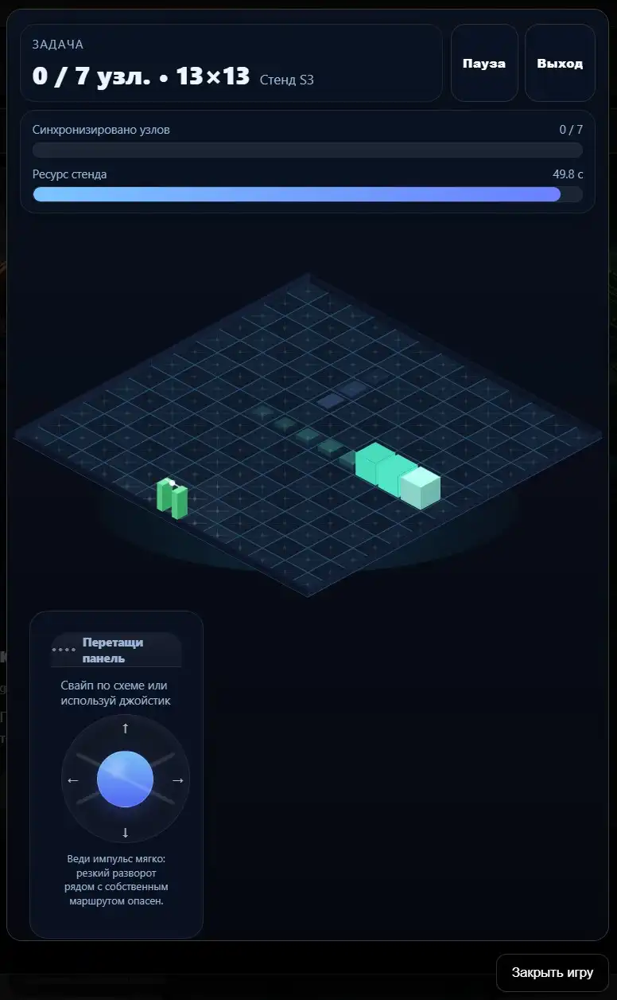
</p>

---

### 🛠 Authoring Tools

Included local tools help prepare 360 packages, edit panorama markers, tune
media focus points, and test mini-games before connecting them to a story.
The story itself remains a plain text script that can be written and edited in
any text editor without special authoring software.

- **360 scene editor** — build `story360.js`, place markers, define panorama
  links, and choose entry camera directions visually.
- **360 image converter** — convert panorama images into offline JS packages
  used by the engine without a server or external asset pipeline.
- **360 panorama cleaner** — replace unwanted people or moving objects with
  matching areas from a second shot and blend the boundaries smoothly.
- **Mini-game tester** — run a game in an iframe, send `gameInit`, inspect
  `gameResult`, and catch protocol mistakes before adding the game to a novel.

<p align="center">
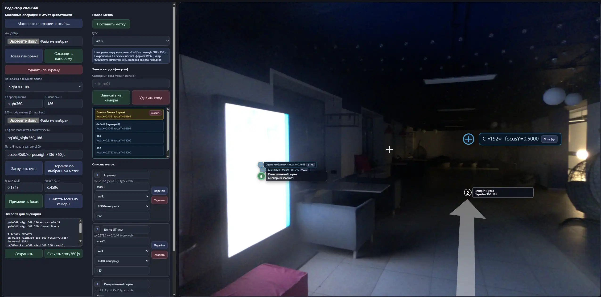
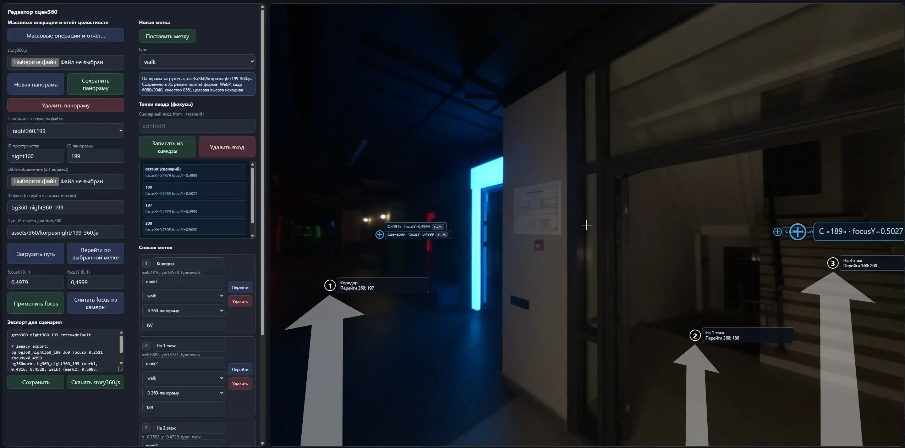
</p>

<p align="center">
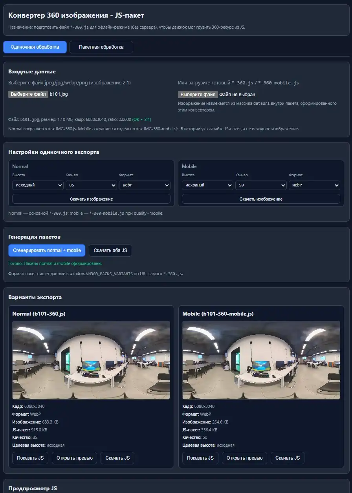

</p>

---

### 📊 Analysis Tools

Script validation and graph generation in Mermaid format.

<p align="center">

</p>

The full story graph shows scenes, choices, transitions, and unreachable nodes.
It helps control story flow, branching, missing links, and other structural
issues while the script grows.

The resources graph shows all story assets and how many times each one is used,
making it easier to find unused media, repeated resources, and asset-heavy
parts of the story.

<p align="center">

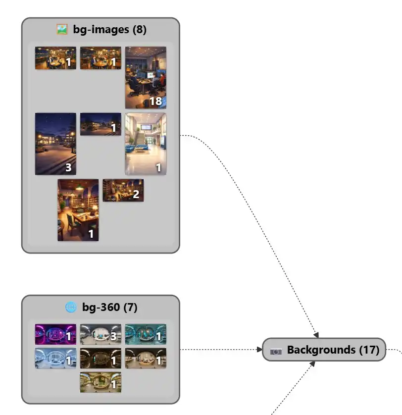
</p>

The games view helps debug mini-games directly inside the engine: launch a
registered game from the menu, choose its difficulty, and check the values it
returns through the `gameResult` protocol.

<p align="center">
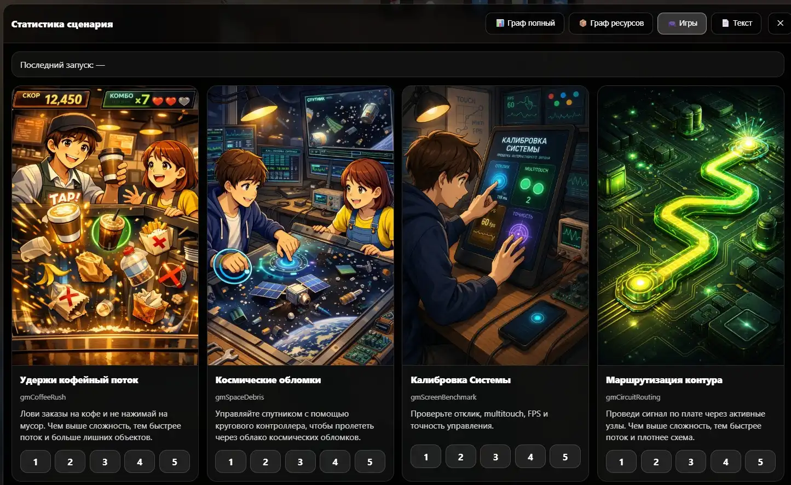
</p>

---

## 🧩 Use Cases

This engine is suitable for:
- interactive stories
- branching educational scenarios
- 360 campus, museum, or exhibition tours
- touch-screen installations with mini-games
- exhibition stands
- educational projects
- university interactive displays
- browser-based narrative games
- vertical information kiosks

---

## 📁 Project Structure

    project/
    │
    ├── index.html
    ├── story-example.js
    ├── story.js          ← your story script, created by you
    ├── story360.js       ← optional 360 space map generated by the editor
    ├── README.md
    ├── LICENSE
    ├── COMMERCIAL-USE.md
    ├── NOTICE.md
    ├── FIRST-STEPS.md
    ├── FIRST-STEPS-RU.md
    │
    ├── engine/
    │    ├── engine.css
    │    ├── engine.js
    │    └── story-loader.js
    │
    ├── docs/
    │    ├── demo/images/           ← visual novel screenshots
    │    ├── 360/                   ← 360 screenshots and panorama examples
    │    ├── games/                 ← mini-game screenshots
    │    ├── kiosk/                 ← real interactive display photos
    │    ├── stat/                  ← statistics and graph screenshots
    │    ├── tools/                 ← authoring tool screenshots
    │    └── specs/
    │         ├── SPEC-STORY.md      ← story scripting specification
    │         └── SPEC-GAME.md       ← mini-game integration specification
    │
    ├── tools/
    │    ├── scene360-editor.html
    │    ├── convert-360-img-to-js.html
    │    ├── game-tester.html
    │    ├── panorama-cleaner.html
    │    └── media-focus-editor.html
    │
    ├── lib/
    └── assets/
             ├── 360/
             ├── backgrounds/
             ├── characters/
             ├── audio/
             ├── video/
             └── games/

In update release archives, `assets/`, `story.js`, and the root `story-example.js`
are not included, so copying an update over an existing novel does not touch
its media files or story. During release packaging, a fresh reference example is
copied into the update archive as `docs/examples/story-example.js`.

---

## 🚀 Quick Start

1.  Download the latest version:

👉 **[Download Latest Release](https://github.com/IlyaBarilo/vn-vertical-engine/releases/latest)**

Release assets include two ZIP variants:

- `vn-vertical-engine-VERSION.zip` — full package with demo media, 360
  panorama packages, mini-games, and tools.
- `vn-vertical-engine-VERSION-update.zip` — update package without `assets/`, `story.js`, and root `story-example.js`.

Use the full archive to run the included demo as-is, including 360 scenes and
mini-game examples. Use the update archive when copying a new engine version
over an existing novel without touching its media files or story.
Inside the update archive, the current example is available as
`docs/examples/story-example.js`.

2.  Extract the archive.

3.  Open **index.html** in your browser.

If `story.js` is absent, the engine automatically loads `story-example.js`.
To start your own novel, copy `story-example.js` to `story.js` and edit `story.js`.

The main story stays in plain text. For larger 360 routes, place an optional
`story360.js` next to `story.js`; for mini-games, register standalone HTML files
in the `[game]` section. The tools in `tools/` are optional helpers for
preparing 360 scenes, media focus points, and mini-game integration.

By default, story progress is saved automatically in the browser and restored
after reloads. The URL launch modes described below can isolate or completely
disable this autosave.

The engine runs completely **offline**.

---

## 📚 First Steps

- [First Steps (EN)](FIRST-STEPS.md)
- [First Steps (RU)](FIRST-STEPS-RU.md)

Use these guides for the recommended workflow:
story idea → draft script → optional mini-games → integration → testing.

---

## 💬 Discussions and Feedback

Use **GitHub Discussions** for questions, ideas, feedback, and showcase posts.

### Categories

- **Q&A** — setup help, scripting questions, engine behavior, and unexpected errors
- **Ideas** — feature suggestions, scripting improvements, and workflow ideas
- **Show and Tell** — projects, demos, experiments, and screenshots made with the engine

### Repository Policy

- **Issues** are disabled by design
- **Projects** are disabled by design
- Use **Discussions** instead of issue reports for questions, feedback, and unexpected problems
- Pull requests are disabled by design

For versioned updates and downloads, see **Releases**.

---

## 📏 Vertical Screen Adjustment

To add top and bottom margins (useful for floor-mounted displays), use
URL parameters:

    index.html?topSpacing=500&bottomSpacing=800

Replace `500` and `800` with your desired values (in pixels).

---

## 🚀 URL Launch Modes and Autosave

The same `story.js` can provide a regular entry point, several independent
novels, and direct scene previews. A `novel` name is not a new script section:
it is both the entry scene id and the namespace of that novel's autosave.

| URL | Start point | Autosave behavior |
| --- | --- | --- |
| `index.html` | `[meta] startScene` | Reads and writes the standard slot |
| `index.html?novel=game01` | Scene `game01` | Reads and writes a separate `game01` slot |
| `index.html?scene=scScene02` | Scene `scScene02` | Does not read, write, or delete saves |
| `index.html?novel=game01&nosave=true` | Scene `game01` | Does not read, write, or delete saves |

### Regular launch

Opening `index.html` without a story launch parameter starts from
`[meta] startScene`. The engine restores the standard autosave when it is
available and valid.

The standard localStorage key remains:

```text
vn_engine_autosave_v1
```

This preserves compatibility with saves created before the URL launch modes
were added.

### Independent novels

To start an independent novel, pass its entry scene id in `novel`:

    index.html?novel=game01

The engine starts from scene `game01` if that novel has no save. Later page
loads restore only this novel's progress. State such as the current scene,
action position, variables, background, character, music, and 360 state stays
inside its named slot.

The slot key is derived from the resolved scene id in lowercase:

```text
vn_engine_autosave_v1:novel:game01
```

Therefore `?novel=Game01` and `?novel=game01` use the same scene and save.
Restart clears only the active novel's slot and starts that novel again. It
does not clear the standard slot or another novel's slot.

The `novel` parameter selects an entry point only when the page is opened.
It does not add commands for switching between independent novels while the
story is already running.

### Direct scene launch

To open a scene directly, pass its id in `scene`:

    index.html?scene=scScene02

This mode is intended for testing, demonstrations, and direct links. It never
reads, writes, or deletes any autosave. Restart opens the same scene again.
Existing standard and novel saves remain untouched.

### Public screens and kiosk mode

Use `nosave=true` when every visitor must start from the beginning:

    index.html?nosave=true
    index.html?novel=game01&nosave=true

The short form also works:

    index.html?novel=game01&nosave

`nosave` has priority over `[meta] autosave`, the standard launch mode, and the
`novel` mode. The page does not restore, create, update, or delete a save.
Existing saves are ignored and remain untouched.

The presence of `nosave` enables the safe kiosk behavior; `true`, `1`, `yes`,
and `on` are the recommended explicit values. Only `false`, `0`, `no`, or
`off` disable the flag. Any other value remains enabled so a typo cannot
accidentally restore a previous visitor's progress.

### Release mode from URL

The URL can force release mode without changing `story.js`:

    index.html?mode=release
    index.html?release

Both forms hide the statistics button and expose `mode` as `release` to the
scenario. They do not change the selected start scene or autosave behavior.
The URL can promote a `debug` story to `release`, but it cannot downgrade a
story whose `[meta] mode` is already `release`.

### Parameter rules

- Parameter names and scene ids are matched without regard to letter case.
- If `scene` and `novel` are both present, `scene` takes priority and saves
  remain disabled.
- An unknown scene id shows an error instead of falling back to another story.
- Two scene ids that differ only by letter case are ambiguous for URL launch
  and also produce an error.
- URL launch parameters can be combined with interface parameters:

      index.html?novel=game01&nosave=true&topSpacing=500&bottomSpacing=800

- `[meta] autosave = false` disables autosave for regular and `novel` launches.
  `scene` and `nosave` disable storage regardless of this setting.

---

## 📝 Script Format

Your working script is stored in `story.js` as a text block.
The included demo script is stored in root `story-example.js` and is used only
when `story.js` is absent. During release packaging, update archives receive a
reference copy at `docs/examples/story-example.js`.

Example:

``` javascript
window.STORY_TEXT = `

[meta]
title = Demo Story
startScene = intro
lang = en
mode = release
window = auto
bg360Quality = auto

[bg]
campusHall file=assets/backgrounds/bg-campus-hall.jpg scroll focusx=0.5 scale=1
labVideo file=assets/backgrounds/bg-it-lab.mp4 fallbackimage=assets/backgrounds/bg-it-lab.jpg volume=0.0
campus360 file=assets/360/B101/b101-360.js 360 quality=auto

[char]
anna emotion=neutral file=assets/characters/ch-anna-neutral.png name="Anna" color=#0F0
anna emotion=smile file=assets/characters/ch-anna.png  # add another emotion for anna
igor emotion=neutral file=assets/characters/ch-igor-neutral.png name="Igor" color=#F00

igor name="Igor" file=assets/characters/ch-igor-smile.png  # if emotion is omitted, neutral is used
igor color=#F00  # values can also be extended in separate lines

[audio]
bgmDay file=assets/audio/bgm-campus-day.mp3 volume=0.5

[video]
introClip file=assets/video/intro.mp4 poster=assets/video/intro.jpg volume=0.8

[game]
gameCoffeeRush file=assets/games/coffee-rush.html title="Coffee Rush" description="Catch orders and avoid mistakes." cover=assets/games/coffee-rush.jpg

[var]
lookResult = ""
resultGame = 0

[scene]
scene intro

bg campusHall

show anna neutral

anna: "Welcome to the demo."

menu
"Go to the lab" -> lab_scene
"Go to the cafe" -> cafe_scene
"Look around in 360" -> look_360


scene cafe_scene
bg labVideo
video introClip skip
game gameCoffeeRush difficulty=3 result=resultGame

if resultGame == 1 -> good_end
if resultGame == 0 -> bad_end

scene look_360
bg campus360 360
bg360marks campus360 (door, 0.30, 0.55, walk) (hint, 0.50, 0.20, text)
walk360 campus360 text="Look around the room." button="Continue" result=lookResult

`;
```

Variable names are case-sensitive: `Score` and `score` are different variables.
The `VARIABLES` section in text statistics checks that names use only English
letters, digits, and `_` and start with a letter or `_`. It also warns when
names differ only by letter case and shows where each spelling is used. Such
groups are often typing mistakes, but the engine does not merge or rename them
automatically.

Other identifiers—scene, background, character, emotion, audio, video, game,
and story360 space and entry IDs—may contain only English letters, digits, and
`_`. Digits are allowed at the beginning. The `IDENTIFIERS` statistics section
reports old or mistyped names that do not follow this rule. File and folder
paths are not identifiers and are checked separately in `FILE CHECK`.
Story360 panorama declarations and mark IDs are not checked. A panorama ID
explicitly used as the target of a `goto360` command is checked.

`FILE CHECK` validates every file name and directory segment used by regular
assets, story360 panoramas, and photo marks. Only English letters, digits, `-`,
and `_` are allowed; the dot before a file extension is treated as a separator.

At the beginning of text statistics, immediately after the license block,
`SUMMARY CHECK` shows the main checks in one line. A green check means that the
corresponding section below has no issues; a red cross means its details should
be reviewed. Reachability and cycle analysis have separate `REACH` and `CYCLES`
statuses.

For larger 360 routes, keep the main story in `story.js` and store the
panorama map in an optional `story360.js` generated by the 360 editor. The
root demo script demonstrates the single-panorama pattern; `goto360` examples
below show the route-map syntax for your own connected spaces.

---

## 📘 Specifications

- [Story Scripting](docs/specs/SPEC-STORY.md)
- [Mini-games](docs/specs/SPEC-GAME.md)

The specifications are currently written in Russian. The first-steps guide is
available in both English and Russian.

---

## 🎬 Core Commands

### Scene

    scene scene_id

### Background

    bg backgroundId

Background assets and commands can also tune media composition:

```text
[bg]
wideCafe file=assets/backgrounds/cafe-wide.jpg scroll focusx=0.47 focusy=0.5 scale=1
labVideo file=assets/backgrounds/lab.mp4 fallbackimage=assets/backgrounds/lab.jpg volume=0.0

[scene]
bg wideCafe transition=fade transitionMs=180
```

Use `scroll` and `focusx`/`focusy` to make wide media draggable or centered on
an important point. Video backgrounds may declare a `fallbackimage` for browsers
or devices that cannot play the video.

### 360 Backgrounds And Spaces

For a single 360 scene, show the panorama with `bg`, add marker definitions with
`bg360marks`, and wait for interaction with `walk360`.

```text
bg bg360Campus 360
bg360marks bg360Campus (door, 0.30, 0.55, walk) (hint, 0.50, 0.20, text)
walk360 bg360Campus text="Look around the room." button="Continue" result=lookResult
```

For larger connected routes, use `tools/scene360-editor.html` to maintain
`story360.js`. Put it next to `story.js`; the launcher loads it automatically.
The snippet below is a format example for a map you create in `story360.js`,
not a separate public demo script.

```text
goto360 korpusNight.174 entry=default
goto360 korpusNight.186 from=scGames
```

`story360.js` stores panorama package paths, entry camera directions, marker
targets, and optional compass labels. This keeps large 360 maps out of the main
story script, and 360 spaces do not need matching entries in the story `[bg]`
section.

For the full 360 syntax, see [Story Scripting](docs/specs/SPEC-STORY.md).

### Characters

    show character emotion
    hide all

### Dialogue

Character:

    anna: "Text"

Narrator:

    "Text"

### Choices

    menu
    "Option 1" -> scene_a
    "Option 2" -> scene_b

### Navigation

    goto scene_id

### Music

    music musicId
    music musicId loop
    music musicId volume=0.8
    music stop

`volume` in `[audio]` sets the default BGM volume for that track. `volume` in the `music` command overrides it for a single playback.

### Video

    video videoId
    video videoId start=1 stop=10
    video videoId skip=false skipText="Skip" fit=contain

---

## 🎮 Mini-games

The engine supports standalone HTML mini-games embedded through iframe.
Declare a game in `[game]`, call it from a scene, and store its numeric result
in a story variable.

```text
[game]
wordSearch file=assets/games/word-search-game.html title="Word Search" description="Find all hidden words." cover=assets/games/word-search-game.jpg

[var]
searchResult = 0

[scene]
scene puzzle
game wordSearch difficulty=3 result=searchResult data="theme=algorithms"
```

`title`, `description`, and `cover` are used by the built-in games view and
resource graph. Extra parameters on the `game` command, such as `difficulty` or
`data`, are forwarded to the mini-game in `gameInit`.

Mini-games must follow the protocol described in
[docs/specs/SPEC-GAME.md](docs/specs/SPEC-GAME.md):

- initialization via `gameInit`
- one final numeric result via `gameResult`
- stable behavior after the result is sent

Use `tools/game-tester.html` or the built-in games view in statistics to test
mini-games before connecting them to the story.

---

## ⚙ Interface Configuration

The UI is designed for **tall vertical displays**, but can also adapt to wider
layouts for video backgrounds, 360 scenes, and desktop previews.

Available settings:
- story mode (`debug` or `release`)
- window mode (`vertical` or `auto`)
- autosave
- transition style and duration
- top spacing
- bottom spacing
- 360 quality mode
- automatic engine optimization mode

Example:

```text
[meta]
mode = release
window = auto
bg360Quality = auto
```

`vertical` is the default mode and keeps the current narrow visual-novel
window. `auto` lets backgrounds, videos, and 360 scene visuals fill the
available screen while keeping the interface centered in the familiar 10:16
area.

This allows adapting the interface for **very tall screens, vertical TVs,
touch kiosks, and wide debugging screens** without changing the story text.

---

## ⚠ Current Limitations

-   minimalistic script format

The engine is focused on **simple interactive projects and
installations**.

---

## 📝 License

### Source Code

Starting from version 0.5, the engine source code (`engine/engine.js`, `engine/engine.css`, `index.html`, `engine/story-loader.js`) is available under the **PolyForm Noncommercial 1.0.0** license.

You may use, study, modify, and share this software for noncommercial purposes.

The default public license also permits use by educational institutions and certain other organizations expressly listed in PolyForm Noncommercial 1.0.0.

Commercial use outside those permitted cases is not allowed unless you obtain separate written permission from the author.

Copyright (c) 2026 Ilya Barilo

See the full license text in the [LICENSE](LICENSE).
See commercial terms in [COMMERCIAL-USE.md](COMMERCIAL-USE.md) (English / Russian).

### Previous Versions

Versions released before 0.5 remain available under the license they were originally published with.

This license change applies to version 0.5 and later.

---

## 📦 Content (Demo Assets)

All files in the `assets/` folder and the demo story content in `story-example.js` are **not covered by the public license for the engine source code**.

They are provided for demonstration purposes only and may not be reused in commercial or noncommercial projects without separate permission from the copyright holder.

When creating your own stories using this engine, you must replace all demo assets and demo story content with your own content.

---

## 📦 Third-Party Components

This project uses the following open-source libraries:

### Mermaid (MIT License)

-   **Purpose:** story flow graphs and resource usage graphs in the
    statistics and analysis panel
-   **File:** `lib/mermaid.min.js` (version 11.x)
-   **License:** MIT (see [NOTICE.md](NOTICE.md) for details)
-   **Usage:** included in the repository without modifications, works
    fully offline

### jsrsasign (MIT License)

-   **Purpose:** offline signature verification for optional license keys
-   **File:** `lib/jsrsasign-all-min.js` (version 11.1.0)
-   **License:** MIT (see [NOTICE.md](NOTICE.md) for details)
-   **Usage:** included in the repository without modifications, works
    fully offline

### three.js (MIT License)

-   **Purpose:** WebGL rendering for 360 backgrounds and multi-panorama
    navigation
-   **File:** `lib/three.min.js` (version 0.152.2)
-   **License:** MIT (see [NOTICE.md](NOTICE.md) for details)
-   **Usage:** included in the repository without modifications, works
    offline in the current distribution format

### Full Notices List

Detailed information about licenses and usage terms of third-party
software can be found in the [NOTICE.md](NOTICE.md) file.

---

## 🔮 Possible Improvements

-   character animations and additional visual effects
-   additional scripting commands

---

## 🔄 Dependency Updates

Mermaid is updated manually as new versions are released.
three.js and jsrsasign are also updated manually as needed.


