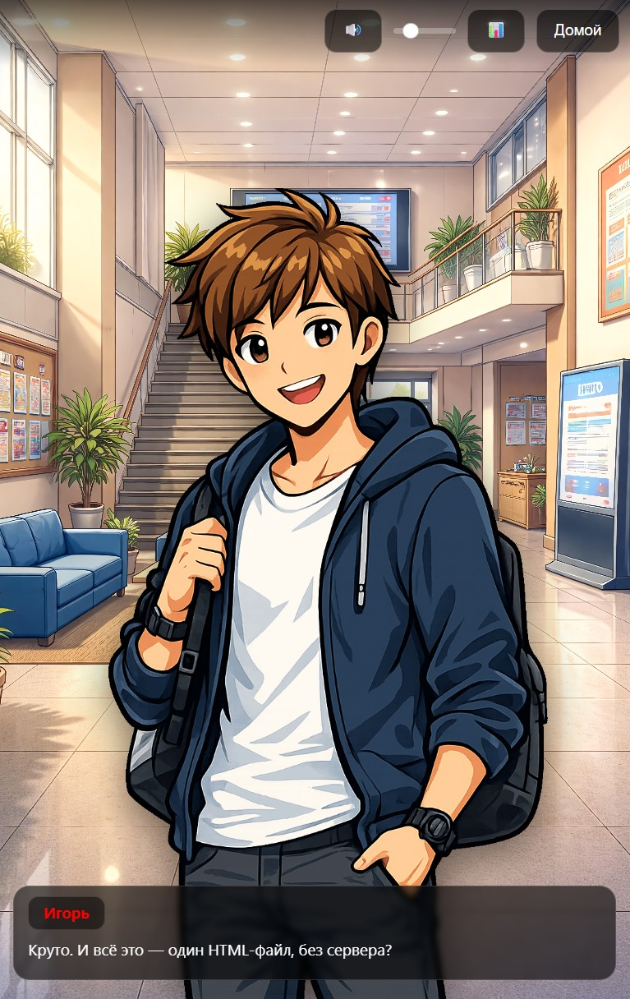
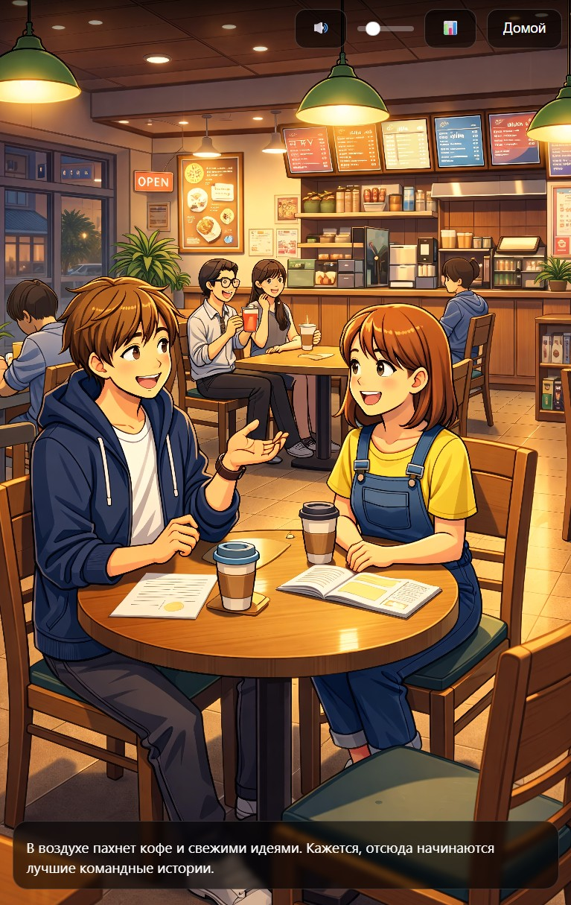
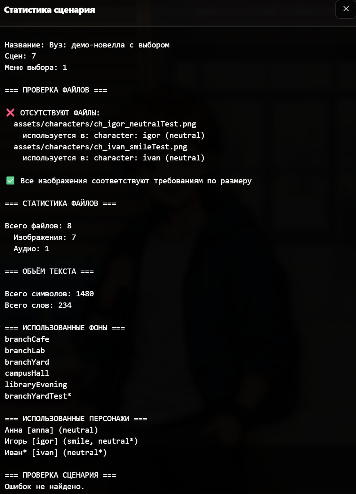
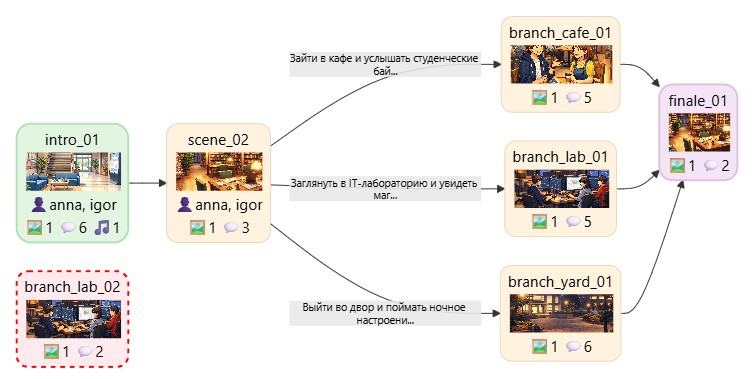
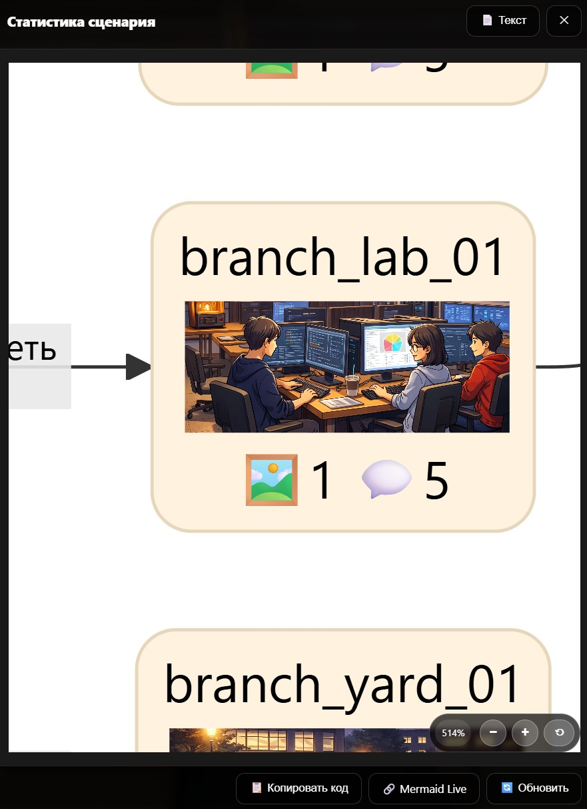

# 🎮 Visual Novel Vertical Engine

<p align="center">
  <strong>Lightweight HTML/CSS/JS visual novel engine built for vertical screens.</strong>
</p>

<p align="center">
  Offline • No build tools • Portrait-first • 4K vertical display ready
</p>

<p align="center">
  <a href="https://ilyabarilo.github.io/vn-vertical-engine/">
    
  </a>
</p>

<p align="center">
  <a href="https://github.com/IlyaBarilo/vn-vertical-engine/stargazers">
    
  </a>
  <a href="https://github.com/IlyaBarilo/vn-vertical-engine/blob/main/LICENSE">
    
  </a>
  <a href="https://github.com/IlyaBarilo/vn-vertical-engine/releases/latest">
    
  </a>
  <a href="https://github.com/IlyaBarilo/vn-vertical-engine/commits/main">
    
  </a>
  <a href="https://github.com/IlyaBarilo/vn-vertical-engine/releases/latest">
    
  </a>
  <a href="https://ilyabarilo.github.io/vn-vertical-engine/">
  
</a>
</p>


A lightweight **offline visual novel engine** built with HTML, CSS, and JavaScript.

Designed for **vertical screens**, **portrait displays**, and **real-world installations** — from kiosks to 4K TVs.

No setup. No dependencies. Just open `index.html` and start.

> Free for noncommercial use.
> Educational institutions may also use this software under the default public license.
> See [LICENSE](LICENSE) for other permitted cases under PolyForm Noncommercial 1.0.0.
> Commercial use outside those cases requires separate written permission from the author.

---

## ✨ Features

-   📱 UI optimized for **vertical screens**
-   🖥 optimized for **4K displays**
-   📐 interface ratio **7:16**, with support for other aspect ratios
-   🌐 **fully offline**
-   ⚡ no build tools or frameworks required
-   🧾 simple **text-based scripting format**
-   🖼 support for **backgrounds**
-   🎭 **characters and emotions**
-   💬 dialogue system
-   🔀 **branching storylines**
-   🎵 background music support
-   📊 built-in **resource loading statistics**
-   📘 **Specifications:** [Story scripting](docs/specs/SPEC-STORY.md), [Mini-games](docs/specs/SPEC-GAME.md)

---

## 📷 Demo

### 🖼️ Visual Novel Demo

<p align="center">




</p>

Also supports horizontal mode:

<p align="center">

</p>

---

### 📊 Analysis Tools

Script validation and graph generation in Mermaid format.

<p align="center">

</p>

Graph rendering inside the engine with navigation support. Useful for
debugging scripts and detecting unreachable nodes (marked in red).

<p align="center">


</p>

---

## 🧩 Use Cases

This engine is suitable for:
- interactive stories
- museum installations
- exhibition stands
- educational projects
- university interactive displays
- browser-based narrative games
- vertical information kiosks

---

## 📁 Project Structure

    project/
    │
    ├── index.html
    ├── story.js
    ├── README.md
    ├── LICENSE
    ├── COMMERCIAL-USE.md
    ├── NOTICE.md
    ├── FIRST-STEPS.md
    ├── FIRST-STEPS-RU.md
    │
    ├── engine/
    │    ├── engine.css
    │    ├── engine.js
    │    └── story-loader.js
    │
    ├── docs/
    │    └── specs/
    │         ├── SPEC-STORY.md      ← scripting specification
    │         └── SPEC-GAME.md       ← mini-game specification
    │
    ├── lib/
    └── assets/
             ├── backgrounds/
             ├── characters/
             ├── audio/
             └── games/

In lite release archives, image, video, and audio files are removed from `assets/`,
but HTML mini-games and engine files remain.

---

## 🚀 Quick Start

1.  Download the latest version:

👉 **[Download Latest Release](https://github.com/IlyaBarilo/vn-vertical-engine/releases/latest)**

Release assets include two ZIP variants:

- `vn-vertical-engine-VERSION.zip` — full package with demo images and audio.
- `vn-vertical-engine-VERSION-lite.zip` — lightweight package without images and audio.

Use the full archive to run the included demo as-is. Use the lite archive as a
smaller starting point when you plan to add your own media files.

2.  Extract the archive.

3.  Open **index.html** in your browser.

The engine runs completely **offline**.

---

## 📚 First Steps

- [First Steps (EN)](FIRST-STEPS.md)
- [First Steps (RU)](FIRST-STEPS-RU.md)

Use these guides for the recommended workflow:
story idea → draft script → optional mini-games → integration → testing.

---

## 💬 Discussions and Feedback

Use **GitHub Discussions** for questions, ideas, feedback, and showcase posts.

### Categories

- **Q&A** — setup help, scripting questions, engine behavior, and unexpected errors
- **Ideas** — feature suggestions, scripting improvements, and workflow ideas
- **Show and Tell** — projects, demos, experiments, and screenshots made with the engine

### Repository Policy

- **Issues** are disabled by design
- **Projects** are disabled by design
- Use **Discussions** instead of issue reports for questions, feedback, and unexpected problems
- Pull requests are disabled by design

For versioned updates and downloads, see **Releases**.

---

## 📏 Vertical Screen Adjustment

To add top and bottom margins (useful for floor-mounted displays), use
URL parameters:

    index.html?topSpacing=500&bottomSpacing=800

Replace `500` and `800` with your desired values (in pixels).

---

## 📝 Script Format

The script is stored in `story.js` as a text block.

Example:

``` javascript
window.STORY_TEXT = `

[meta]
title = Demo Story
startScene = intro
lang = en

[bg]
campusHall file=assets/backgrounds/bg-campus-hall.jpg

[char]
anna emotion=neutral file=assets/characters/ch-anna-neutral.png name="Anna" color=#0F0
anna emotion=smile file=assets/characters/ch-anna.png  # add another emotion for anna
igor emotion=neutral file=assets/characters/ch-igor-neutral.png name="Igor" color=#F00

igor name="Igor" file=assets/characters/ch-igor-smile.png  # if emotion is omitted, neutral is used
igor color=#F00  # values can also be extended in separate lines

[audio]
bgmDay file=assets/audio/bgm-campus-day.mp3

[video]
introClip file=assets/video/intro.mp4 poster=assets/video/intro.jpg volume=0.8

[var]
resultGame = 0

[game]
gameCoffeeRush file=assets/games/coffee-rush.html

[scene]
scene intro

bg hall

show anna neutral

anna: "Welcome to the demo."

menu
"Go to the lab" -> lab_scene
"Go to the cafe" -> cafe_scene


scene cafe_scene
game gameCoffeeRush difficulty=3 result=resultGame

if resultGame == 1 -> good_end
if resultGame == 0 -> bad_end

`;
```

---

## 📘 Specifications

- [Story Scripting](docs/specs/SPEC-STORY.md)
- [Mini-games](docs/specs/SPEC-GAME.md)

---

## 🎬 Core Commands

### Scene

    scene scene_id

### Background

    bg backgroundId

### Characters

    show character emotion
    hide all

### Dialogue

Character:

    anna: "Text"

Narrator:

    "Text"

### Choices

    menu
    "Option 1" -> scene_a
    "Option 2" -> scene_b

### Navigation

    goto scene_id

### Music

    music musicId
    music musicId loop
    music stop

### Video

    video videoId
    video videoId start=1 stop=10
    video videoId skip=false skipText="Skip" fit=contain

---

## 🎮 Mini-games

The engine supports embedding mini-games via iframe.

⚠️ Important:
Mini-games must follow the strict communication protocol described in:

👉 [docs/specs/SPEC-GAME.md](docs/specs/SPEC-GAME.md)

This includes:
- initialization via `gameInit`
- returning results via `gameResult`
- strict rules required for compatibility

---

## ⚙ Interface Configuration

The UI is designed for **tall vertical displays**.

Available settings:
- top spacing
- bottom spacing

This allows adapting the interface for **very tall screens and vertical
TVs**.

---

## ⚠ Current Limitations

-   no save/load system
-   minimalistic script format

The engine is focused on **simple interactive projects and
installations**.

---

## 📝 License

### Source Code

Starting from version 0.5, the engine source code (`engine/engine.js`, `engine/engine.css`, `index.html`, `engine/story-loader.js`) is available under the **PolyForm Noncommercial 1.0.0** license.

You may use, study, modify, and share this software for noncommercial purposes.

The default public license also permits use by educational institutions and certain other organizations expressly listed in PolyForm Noncommercial 1.0.0.

Commercial use outside those permitted cases is not allowed unless you obtain separate written permission from the author.

Copyright (c) 2026 Ilya Barilo

See the full license text in the [LICENSE](LICENSE).
See commercial terms in [COMMERCIAL-USE.md](COMMERCIAL-USE.md) (English / Russian).

### Previous Versions

Versions released before 0.5 remain available under the license they were originally published with.

This license change applies to version 0.5 and later.

---

## 📦 Content (Demo Assets)

All files in the `assets/` folder and the demo story content in `story.js` are **not covered by the public license for the engine source code**.

They are provided for demonstration purposes only and may not be reused in commercial or noncommercial projects without separate permission from the copyright holder.

When creating your own stories using this engine, you must replace all demo assets and demo story content with your own content.

---

## 📦 Third-Party Components

This project uses the following open-source libraries:

### Mermaid (MIT License)

-   **Purpose:** visualization of story graphs in debug and analysis
    mode
-   **File:** `lib/mermaid.min.js` (version 11.x)
-   **License:** MIT (see [NOTICE.md](NOTICE.md) for details)
-   **Usage:** included in the repository without modifications, works
    fully offline

### Full Notices List

Detailed information about licenses and usage terms of third-party
software can be found in the [NOTICE.md](NOTICE.md) file.

---

## 🔮 Possible Improvements

-   save/load system
-   animations
-   additional scripting commands

---

## 🔄 Dependency Updates

Mermaid is updated manually as new versions are released.


